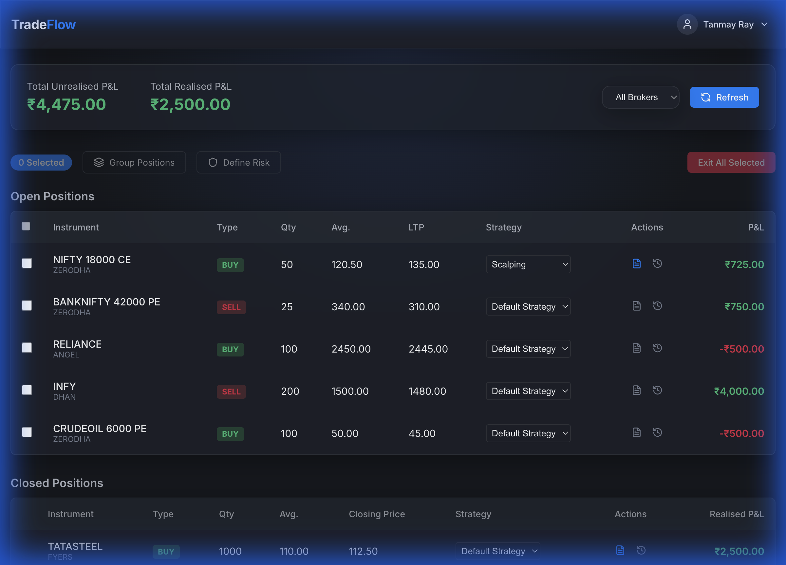
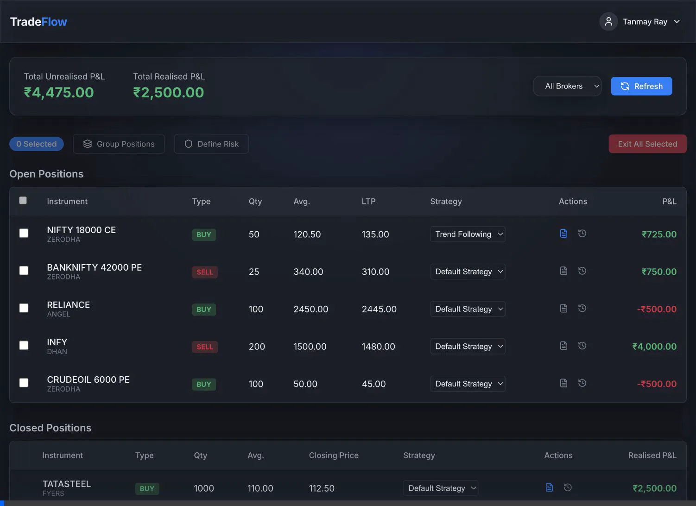

# TradeFlow Application Showcase

This document provides a comprehensive visual walkthrough of the **TradeFlow** application features, demonstrating every major capability with screenshots and recordings.

## 1. Home Page & Configuration
**Files Referenced**:
- `home_page_verification_1765525137038.webp`

**Capabilities Shown**:
- Broker Selection (Multi-select grid).
- Global Settings Modal (Refresh Rate, Stop Loss Wait).
- Navigation gating (Continue button disabled until brokers selected).

---

## 2. Global Positions Management
**Files Referenced**:
- `positions_page_verification_1765525262443.webp`
- `final_positions_page_1765527262323.png`

**Capabilities Shown**:
- **Consolidated View**: All positions from selected brokers.
- **Grouping**: Creating named groups (e.g., "Nifty Hedging") for correlated positions.
- **Risk Management**: "Define Risk" modal to set Profit Targets and Stop Losses.
- **Filtering**: Filter positions by Broker.

### Workflow Recording (Grouping & Risk)

### Static View (Strategies Column)

---

## 3. Advanced Features: Strategies & Group Notes
**Files Referenced**:
- `refinements_verification_1765528976062.webp`

**Capabilities Shown**:
- **Group Strategy**: Setting a strategy (e.g., "Mean Reversion") on the Group Row automatically updates all child positions.
- **Group Notes**: Adding notes to entire groups.
- **Strategy Dropdown**: Per-position strategy assignment.

---

## 4. Trading Journal
**Files Referenced**:
- `screenshot_journal_page_1765526234860.png`
- `refinements_verification_1765528976062.webp` (End of recording)

**Capabilities Shown**:
- **Year View**: 12-month calendar heatmap. (Green = Profit, Red = Loss).
- **Day Details**: Clicking a day shows the "Details Modal" with:
    - Symbols traded.
    - Trade Type (Buy/Sell).
    - **Strategy** used.
    - **P&L** for that specific trade.
- **UI Polish**: Day numbers and P&L Tooltips on hover.

### Journal Year View

### Journal Interaction (Drill Down)
*See the end of the "Group Strategy & Refinements" recording above for the live interaction.*
